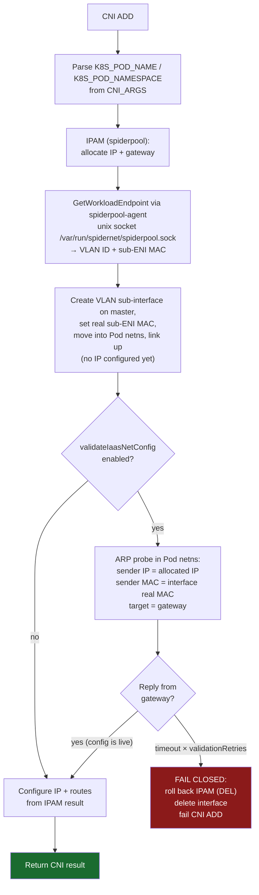

# eni-vlan

[](https://github.com/spidernet-io/eni-vlan/actions/workflows/ci.yml)
[](https://goreportcard.com/report/github.com/spidernet-io/eni-vlan)
[](LICENSE)

**IaaS sub-ENI CNI plugin for the [Spiderpool](https://github.com/spidernet-io/spiderpool) cloud network provider.**

eni-vlan creates VLAN sub-interfaces inside Pod network namespaces for cloud IaaS sub-ENI scenarios: the IP address, VLAN ID and MAC address are all allocated by the cloud platform and delivered through spiderpool-agent at Pod creation time. Before handing the interface to the Pod, eni-vlan performs a **final connectivity validation** of the cloud-assigned IP/VLAN/MAC triple, so misconfigured or not-yet-effective cloud bindings fail the Pod fast instead of producing a silently broken network.

## Relationship with the community vlan CNI

eni-vlan does **not** support static VLAN configuration. If you need a plain VLAN sub-interface with a `vlanId` from the CNI config, use the [community vlan CNI plugin](https://github.com/containernetworking/plugins/tree/main/plugins/main/vlan) — that is exactly its job. eni-vlan exists only for the dynamic IaaS sub-ENI scenario where VLAN/MAC/IP come from the cloud via spiderpool-agent.

| Feature | Community vlan CNI | eni-vlan |
|---|---|---|
| VLAN ID source | Static CNI config | spiderpool-agent (cloud-allocated) |
| MAC address | Not managed | Set to the real sub-ENI MAC from spiderpool-agent |
| IP assignment | Any IPAM plugin | Spiderpool IPAM |
| Connectivity validation | None | Pre-flight ARP probe of the IP/VLAN/MAC triple |

## How It Works



## Connectivity Validation

This is neither a classic "gateway reachability check" nor RFC 5227 IP-conflict detection. It is a **final pre-flight validation of the cloud-assigned IP/VLAN/MAC triple**: it verifies that an interface built with this exact configuration can actually talk to the outside world *before* the Pod starts.

Why it lives here and only here:

- IaaS fabrics enforce strict anti-spoofing: only packets with **source IP = bound IP, source MAC = real sub-ENI MAC, and the correct VLAN tag** are forwarded. ARP probes sourced from `0.0.0.0`, unbound IPs, forged MACs or wrong VLANs are silently dropped.
- Consequently RFC 5227-style probing (`0.0.0.0` sender) is physically impossible, and the fabric's IP-MAC binding already rules out IP conflicts — no conflict detection is needed.
- At the IPAM plugin stage no interface exists yet (nothing to probe from); at the coordinator stage the IP is already configured, so the kernel passively answers ARP and pollutes fabric neighbor tables (see spiderpool [#4582](https://github.com/spidernet-io/spiderpool/issues/4582)/[#4588](https://github.com/spidernet-io/spiderpool/issues/4588)).
- The **only safe window** is inside eni-vlan: after the VLAN sub-interface exists with its real MAC and is up, but before any IP is configured.

The probe: an ARP request with sender IP = allocated IP, sender MAC = interface real MAC (kernel-filled, AF_PACKET SOCK_DGRAM), target = gateway IP, executed inside the Pod netns.

- Gateway replies → the whole cloud configuration is live, proceed.
- No reply after `validationRetries` attempts → wrong VLAN / MAC not effective / IP-MAC binding not pushed. The CNI ADD **fails closed**: IPAM allocation is rolled back and the interface deleted.

IPv4 (ARP) only for now; IPv6 (NS/NA) is a TODO. If the IPAM result contains no IPv4 gateway, the check is skipped.

## Configuration

### Fields

| Field | Type | Required | Default | Description |
|---|---|---|---|---|
| `master` | string | Yes | — | Host network interface (the ENI) to attach the VLAN sub-interface to |
| `mtu` | int | No | master MTU | MTU for the VLAN sub-interface |
| `linkInContainer` | bool | No | `false` | Whether the master link is in the container namespace |
| `validateIaasNetConfig` | bool | No | `false` | Enable the pre-flight validation of the cloud-assigned IP/VLAN/MAC triple |
| `validationRetries` | int | No | `3` | ARP probe attempts before failing |
| `validationTimeoutMs` | int | No | `500` | Per-probe reply timeout in ms (real IaaS gateway ARP RTT measured at ~48ms) |
| `ipam` | object | Yes | — | IPAM plugin config (spiderpool) |

The legacy `vlanId` and `vlanMode` fields are rejected with an error. These fields (and the CNI conf as a whole) are intended to be rendered and delivered by SpiderMultusConfig in the future.

### Example

```json
{
  "cniVersion": "1.0.0",
  "name": "eni-network",
  "type": "eni-vlan",
  "master": "eth0",
  "validateIaasNetConfig": true,
  "validationRetries": 3,
  "validationTimeoutMs": 500,
  "ipam": {
    "type": "spiderpool"
  }
}
```

> spiderpool-agent must be running and its Unix socket must be accessible at `/var/run/spidernet/spiderpool.sock`.

## Requirements

- Linux kernel with 802.1Q VLAN support
- Go 1.25+
- [spiderpool](https://github.com/spidernet-io/spiderpool) deployed in the cluster

## Building

```bash
# Clone the repository
git clone https://github.com/spidernet-io/eni-vlan.git
cd eni-vlan

# Download dependencies
make deps

# Build the binary for the current platform (outputs to ./bin/eni-vlan-<os>-<arch>)
make build

# Cross-compile
GOOS=linux GOARCH=amd64 go build -o bin/eni-vlan-linux-amd64 ./cmd/eni-vlan
GOOS=linux GOARCH=arm64 go build -o bin/eni-vlan-linux-arm64 ./cmd/eni-vlan
```

The compiled binary is the CNI plugin. Copy it to the CNI bin directory on each node (typically `/opt/cni/bin/eni-vlan`).

## Project Structure

```
eni-vlan/
├── cmd/eni-vlan/      # Plugin entry point (main.go)
├── pkg/
│   ├── config/        # NetConf definition and validation
│   ├── networking/    # ARP-based connectivity validation
│   └── vlan/
│       ├── interface.go   # VLAN create / delete / MAC update
│       └── service.go     # CNI ADD flow (IPAM → agent → VLAN → validate → IP)
├── docs/
│   └── design.md      # Detailed design specification
├── Makefile
└── go.mod
```

## Documentation

See [docs/design.md](docs/design.md) for the full design specification, including detailed flow diagrams, the `GetWorkloadEndpoint` API reference, the connectivity validation design, error handling table, and implementation notes.

## License

Apache License 2.0 — see [LICENSE](LICENSE).
